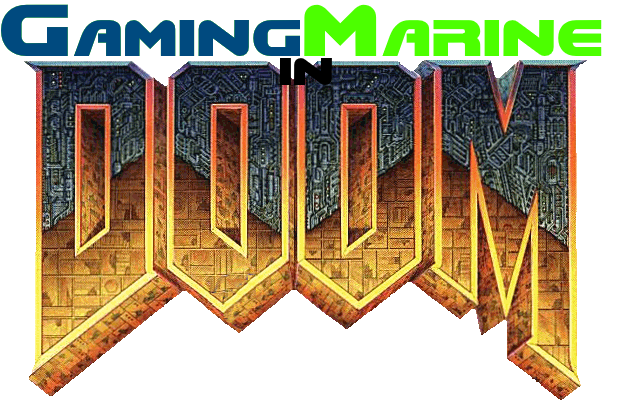

# GamingMarine in Doom

***GamingMarine in Doom*** is a mod for ZDoom-comptable source ports which aims to be what is essentially the most absurd concept for a Doom mod someone could come up with: A self-insert teaming up with a demon girl to stop an alliance of cartoon characters from taking over the universe. While this concept is unappealing on its own, its *execution* is what matters most.

This mod aims to be a high-end gameplay experience for lower-end players (i.e. [Freedoom (Android app)](https://play.google.com/store/apps/details?id=net.nullsum.freedoom&hl=en_US&gl=US), Zandronum), with a wide range of new content added in to breathe new life to classic *Doom* levels. A large chunk of the mod's content also pays homage to classic first-person shooters and arcade games, namely titles like *Duke Nukem 3D*, *Revolution X*, and *Metal Slug*.

***GamingMarine in Doom*** initially started life back in late 2016 as a simple heads-up display replacement. Now, it is my biggest project to date, spanning five years of constant development. Hope you enjoy playing this mod as much as I did making it!

 *—Peyton "GamingMarine" Gagliano*
 
 ## Fair Warning
 
GamingMarine in Doom is a work of fiction and was created solely for the purpose of entertainment. In no way was it designed as a political statement, nor was it intended to promote hatred towards any particular group of people. Any relations between this mod and real-life events are purely coincidental. If you still feel uncomfortable about this mod's subject matter, distancing yourself from this mod is strongly advised.

## The Story Thus Far
***Insert graphic here***

The year is 2145, in a future where military businesses can give jobs to teenagers in a similar fashion to fast food shifts. You are **Peyton "GamingMarine" Gagliano**, a member of the **Union Aerospace Corporation**'s freshly-founded **Youthfully-Allied Marines (YAM)** program. Just a few weeks ago, the UAC caved in to the frequent demands of an unspecified group of people to connect the boundaries of our world to a cartoon dimension. While the project (Internally codenamed **Project: Universe**) was at first deemed successful, it quickly turned into a disaster, with scientists and civilians being either slaughtered on the spot on corrupted to join what is known as the **Master Force***. Long story short, what you thought was going to be another boring shift has evolved into something even worse; Your fellow buddies have lost their lives, Deimos has disappeared from Mars's orbit, and the human race is reported to be on the brink of extinction back on Earth. Using the UAC's powerful arsenal and the presence of a mysterious demon, your mission is clear: ***Kick ass and take names!***

The events of GamingMarine in Doom are as follows:
 - **Knee-Deep in the Dead:** Where it all begins. You have been sent to Phobos to investigate the origin of the invasion and clean up the mess left by the Master Force.
 - **The Shores of Hell:** After your "janitor" job on Phobos, you travel to the lost Deimos base to continue your investigation. Once you find the truth, all will go downhill!
 - **Inferno:** Your first visit to the Master Force's home dimension, where all is red and carcasses are decorations. Your task here is to seal up the gate between their world and ours... or die trying!
 - **Thy Flesh Consumed:** In between **Inferno** and **Hell on Earth** is one of the toughest experiences you'll have! Travel through distorted cities and avoid easy death around every corner.

***UNDER CONSTRUCTION***

## Getting Started

GamingMarine in Doom requires a commercial Doom IWAD in order to play. This includes *Doom (registered)*, [*Doom II*](https://store.steampowered.com/app/2300/DOOM_II/), [*The Ultimate Doom*](https://store.steampowered.com/app/2280/Ultimate_Doom/), and either chapter of [*Final Doom*](https://store.steampowered.com/app/2290/Final_DOOM/) (*TNT: Evilution* and *The Plutonia Experiment*). If you are unable to acquire a commercial IWAD, the mod is also fully compatible with any open-source alternative, such as [*FreeDoom*](https://freedoom.github.io/), [*The People's Doom*](http://www.doomlegends.com/tpd/nfmain.html), and [*Satanic Infestion*](https://github.com/sergeirocks100/satanicinfestation).

**NOTE: Playing with an IWAD generated from [*Wadsmoosh*](https://jp.itch.io/wadsmoosh) is** ***not*** **recommended, due to the way that program handles stuff like intermission content and textures.**

You will also need [*GZDoom*](https://www.zdoom.org/downloads) in order to play this mod. 2.1pre is the minimum-tested version, but the mod runs best using the latest version of the source port. [*Zandronum*](https://zandronum.com/) is also supported, but has not been tested nearly as much as *GZDoom*, so expect an issue or two. [**ZDoom**](https://www.zdoom.org/downloads) ***and*** [**Skulltag**](http://www.skulltag.com/) ***have not been tested AT ALL and are in no way guaranteed to work with GamingMarine in Doom. YOU HAVE BEEN WARNED!***
